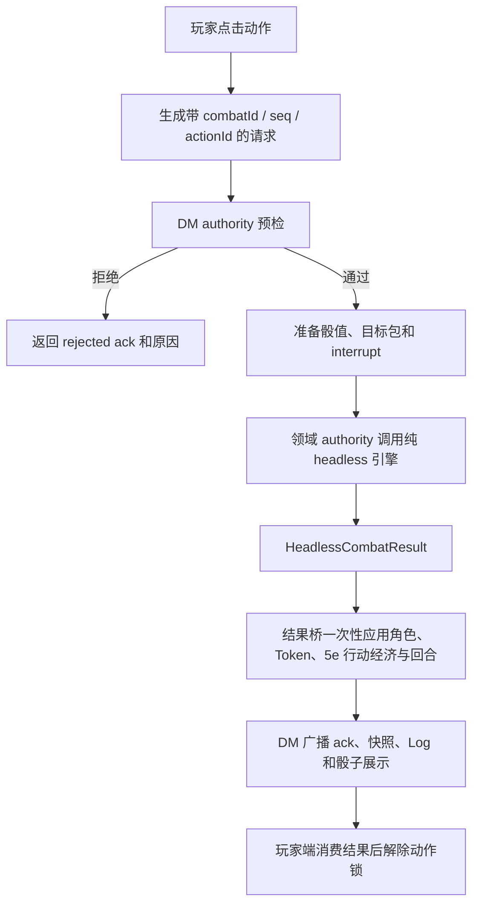

# Headless DM 战斗流程

本文描述迁移完成后的唯一战斗结算路径。DM 端是权威端；玩家端只提交动作、处理属于该玩家的确认，并展示 DM 返回的结果。

职业资源操作统一使用 `class-resource-action`，请求中携带资源 key、数量和操作类型。
`qi-reduce-cooldown` 只用于接收旧客户端请求，新客户端不得继续发送。

## 总流程

## 权威边界

- `MapsPage.tsx` 负责 UI、投骰动画、弹窗和广播，不直接调用核心 resolver。
- `playerActionAuthorityExecution.ts` 统一检查战斗 ID、回合、当前角色和重复消息。
- 各领域模块负责把请求转换为 headless action：攻击、AOE、移动、特性、敌方行动、借机攻击和回合结束。
- `headlessDmCombatEngine.ts` 是动作、附赠动作、反应、移动、伤害、状态、职业资源和回合变化的纯计算源。
- `headlessCombatBridge.ts` 比较前后快照，只把发生变化的角色和 Token 写入 store。
- 玩家端不能直接决定 HP、敌方行动经济、规则效果或回合推进。

## 玩家动作

1. 玩家端创建 `SharedPlayerActionState`，附带自增序号、战斗 ID、回合和先攻索引。
2. 玩家端立即进入 pending 锁，阻止同一角色发送第二个冲突动作。
3. DM 端运行统一 preflight；旧战斗、错误回合、重复 ID 和非当前角色请求会被拒绝。
4. 请求按类型路由到特性、普通动作、单体攻击、AOE 或移动 authority。
5. authority 返回 `HeadlessCombatResult` 后，DM 一次性应用状态并发送 ack。
6. 玩家端只根据 ack 接受结果或回滚本地预览，随后解除动作锁。

## 单体攻击与 AOE

- 单体攻击的所有伤害组先组成一个 `targetPacket`，之后只提交一次 headless action。
- 多重射击等多段攻击使用多个 target packet，但仍属于同一个攻击动作，不会重复消耗动作。
- AOE 只投一次共享基础伤害骰；每个目标仅拥有自己的豁免、额外伤害和状态 packet。
- 闪避、豁免和额外骰值在执行前固定，动画显示值与 DM 结算值使用同一份数据。
- 伤害、临时生命、死亡、状态和 CD 变化全部在 headless result 中产生。

## 移动

移动采用两阶段提交：

1. DM 先用同一份快照验证剩余移动、障碍物、移动锁和借机攻击者。
2. 没有借机攻击时直接提交移动。
3. 有借机攻击时先执行 deferred move，结算所有借机攻击。
4. 移动者仍存活时提交最终位置；死亡时保留原位置并结束动作。

这保证移动只结算一次，也避免 Token 在借机攻击期间先移动再回弹。

## Interrupt

闪避、灵巧跳跃、残影脱身、疾风连击等插入确认统一使用 interrupt queue。请求包含唯一 ID、控制角色、过期时间和阶段；响应只能消费一次。超时走明确的拒绝分支，不会让战斗永久卡住。

### DM 裁定行动事务

已选但尚未机械化的动作／附赠动作法术使用 `dnd5e-adjudicated-spell` 请求与 `dm-adjudication` Interrupt：

1. 玩家只提交法术 ID 与所选环位；请求中不存在伤害、治疗、目标或状态字段。
2. DM Authority 重新核对已知／准备法术、施法时间、当前回合、荒野变形、法术位／契约位／秘法奥秘及免费施法来源。预检只读取状态，不扣资源。
3. DM-only Interrupt 显示规则正文；DM 可取消，或填写多个目标的最终伤害、治疗、临时 HP、状态增删、专注轮数与公开裁定备注。
4. 批准后由 `adjudicated-spell` Headless action 在同一纯事务中消费动作／附赠动作与施法资源，并应用全部白名单效果。取消、超时、目标失效、回合变化或最终复检失败均不消费。
5. 事务沿用玩家 action ID 生成确定性的 Interrupt ID；刷新后可恢复 pending／answered 状态，ACK、权威快照与日志仍由原玩家动作提交链一次性发布。

DM 填写的伤害必须是完成命中、豁免、抗性和易伤裁定后的最终值。该入口不允许任意 Store patch、DOM／网络脚本或玩家提供结算结果；反应法术仍必须由各自的触发器 Interrupt 接入。

## 敌方行动

- DM 本地 AI 选择移动或攻击，但仍必须通过敌方领域 authority。
- 敌方按 SRD 数据块拥有正常移动与一个动作；多重攻击属于同一个动作，同一敌人的后续结算等待前一步完成。
- 玩家闪避响应返回 DM 后，由 DM 计算命中、伤害、临时生命和死亡。
- 战斗开始、回合推进和战斗结束均由 headless lifecycle authority 生成状态。

## 结算模式

DM 在战斗控制栏选择结算模式，选择结果写入 `SharedCombatState.settlementMode`，加入中的玩家与刷新后的客户端都以 DM 快照为准。旧快照缺少该字段时按“自动结算”处理。

- **自动结算**：玩家动作和怪物行动都走现有 DM Authority／Headless 链；怪物完成行动后自动推进回合。
- **手动结算**：不执行玩家自动动作与怪物 AI。玩家和 DM 都可选择骰子数量、骰面和加值进行明骰；DM 还可暗骰、手动应用伤害／治疗／临时生命值，并手动推进先攻。
- **手动**：双方使用公共骰盘；DM 可在怪物回合拖动当前怪物，并从数据块选择攻击及目标。移动和攻击仍由 Headless 校验。

明骰会先广播预定骰面供所有客户端播放一致动画，再写入共享骰子事件与战斗日志。暗骰只在 DM 本地生成和显示，不发送投骰请求、不写共享骰子事件或战斗日志；玩家端的共享骰消费层还会拒绝任何标记为 `visibility: 'dm'` 的事件，作为兼容旧客户端或异常写入时的第二道保护。

手动应用生命值仍由 DM 端写入权威 Store 并经既有多端状态同步传播。伤害先扣临时生命值，治疗不超过生命上限，新临时生命值与旧值取较高者。它是显式的 DM 裁定入口，不调用自动攻击 resolver，也不恢复旧 AP 或攻防差值规则。

## 战斗经验结算

战斗停止后，DM 端按结束时的权威地图快照统计经验值：只计算当前已被击败的敌方单位，优先读取 SRD 怪物模板的 `challenge.xp`；旧模板按 SRD CR→XP 表回退。仍存活、无 CR 的空白敌人和规则／法术召唤物均不计入。

参战角色取本场先攻列表中的友方角色 Token。DM 可以选择平均分配或逐角色自由分配；自由分配总和必须等于本场总 XP。确认后，角色经验值、角色上的 `combatId` 发奖收据及战役统计中的经验结算记录共同持久化。角色收据防止断线重试重复加值，统计会显示每场怪物 XP 与分配明细。“本场不发放”也会留下已处理记录，但不会修改角色经验值。

## 迁移守卫

`headlessMigrationBoundary.test.ts` 禁止 `MapsPage.tsx` 重新导入核心 resolver、旧 `CombatResolutionRunner` 或 mutation authority。新增战斗行为应扩展领域 action 和 headless engine，而不是在页面直接改 HP、行动经济或 store。
