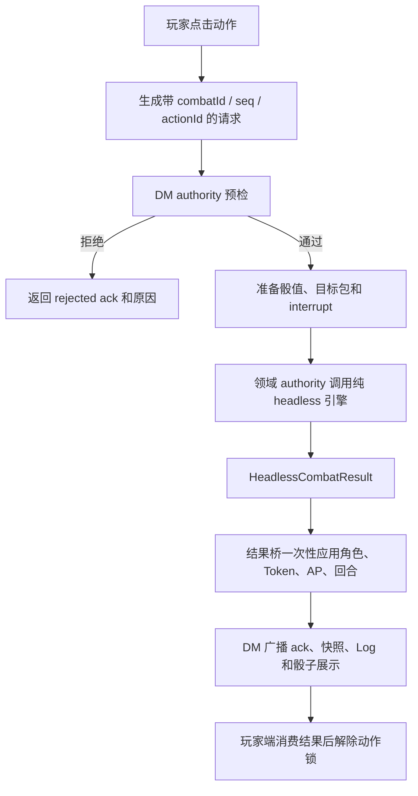

# Headless DM 战斗流程

本文描述迁移完成后的唯一战斗结算路径。DM 端是权威端；玩家端只提交动作、处理属于该玩家的确认，并展示 DM 返回的结果。

职业资源操作统一使用 `class-resource-action`，请求中携带资源 key、数量和操作类型。
`qi-reduce-cooldown` 只用于接收旧客户端请求，新客户端不得继续发送。

## 总流程

## 权威边界

- `MapsPage.tsx` 负责 UI、投骰动画、弹窗和广播，不直接调用核心 resolver。
- `playerActionAuthorityExecution.ts` 统一检查战斗 ID、回合、当前角色和重复消息。
- 各领域模块负责把请求转换为 headless action：攻击、AOE、移动、特性、敌方行动、借机攻击和回合结束。
- `headlessDmCombatEngine.ts` 是 AP、伤害、状态、技能次数、冷却和回合变化的纯计算源。
- `headlessCombatBridge.ts` 比较前后快照，只把发生变化的角色和 Token 写入 store。
- 玩家端不能直接决定 HP、敌方 AP、技能效果或回合推进。

## 玩家动作

1. 玩家端创建 `SharedPlayerActionState`，附带自增序号、战斗 ID、回合和先攻索引。
2. 玩家端立即进入 pending 锁，阻止同一角色发送第二个冲突动作。
3. DM 端运行统一 preflight；旧战斗、错误回合、重复 ID 和非当前角色请求会被拒绝。
4. 请求按类型路由到特性、普通动作、单体攻击、AOE 或移动 authority。
5. authority 返回 `HeadlessCombatResult` 后，DM 一次性应用状态并发送 ack。
6. 玩家端只根据 ack 接受结果或回滚本地预览，随后解除动作锁。

## 单体攻击与 AOE

- 单体攻击的所有伤害组先组成一个 `targetPacket`，之后只提交一次 headless action。
- 多重射击等多段攻击使用多个 target packet，但仍属于同一个 action，不会重复扣 AP。
- AOE 只投一次共享基础伤害骰；每个目标仅拥有自己的豁免、额外伤害和状态 packet。
- 闪避、豁免和额外骰值在执行前固定，动画显示值与 DM 结算值使用同一份数据。
- 伤害、临时生命、死亡、状态和 CD 变化全部在 headless result 中产生。

## 移动

移动采用两阶段提交：

1. DM 先用同一份快照验证距离、AP、障碍物、移动锁和借机攻击者。
2. 没有借机攻击时直接提交移动。
3. 有借机攻击时先执行 deferred move，结算所有借机攻击。
4. 移动者仍存活时提交最终位置；死亡时保留原位置并结束动作。

这保证 AP 只扣一次，也避免 Token 在借机攻击期间先移动再回弹。

## Interrupt

闪避、灵巧跳跃、残影脱身、疾风连击等插入确认统一使用 interrupt queue。请求包含唯一 ID、控制角色、过期时间和阶段；响应只能消费一次。超时走明确的拒绝分支，不会让战斗永久卡住。

## 敌方行动

- DM 本地 AI 选择移动或攻击，但仍必须通过敌方领域 authority。
- 敌方移动和每次攻击分别消耗 AP；同一敌人的后续行动等待前一次完整结算。
- 玩家闪避响应返回 DM 后，由 DM 计算命中、伤害、临时生命和死亡。
- 战斗开始、回合推进和战斗结束均由 headless lifecycle authority 生成状态。

## 迁移守卫

`headlessMigrationBoundary.test.ts` 禁止 `MapsPage.tsx` 重新导入核心 resolver、旧 `CombatResolutionRunner` 或 mutation authority。新增战斗行为应扩展领域 action 和 headless engine，而不是在页面直接改 HP/AP/store。
