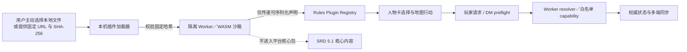

# D&D 5e Rules Plugin API

## 目标

平台核心包只携带 D&D 5e 2014／SRD 5.1（CC BY 4.0）内容。Rules Plugin API 允许用户主动安装独立的第三方规则包，并让该包以声明式方式注册通用人物特性，以及由 DM 权威执行的受控 Headless Action。

插件 API 是扩展机制，不是版权或商标许可。平台不应制作、预装、托管、索引、销售或背书没有相应授权的第三方规则包。插件发布者必须在清单中声明发布者与内容许可；安装者负责确认自己有权取得和使用插件内容。

## 边界



- 核心子职 ID 使用短 ID，例如 `champion`。
- 插件贡献由 Host 自动命名空间化，例如插件 `com.example.options` 注册本地 ID `guardian` 后，存档 ID 为 `com.example.options:guardian`。
- 插件资源、特性与 Headless Action 同样使用插件命名空间，不能覆盖核心定义或其他插件。
- 插件卸载后，角色存档只保留 opaque ID 与选择值；平台不会复制或回退显示插件名称、规则文本和效果。
- Headless resolver 只在权威结算路径执行。普通插件 Action 默认只能由当前行动者执行；反应和 Interrupt 必须显式声明 `allowOffTurn`。
- API V2 的 `registerFeature` 声明特性文字、等级、自动化级别、动作／附赠动作／反应和目标规则。人物卡只保存完整命名空间 ID。
- `registerRace` 可声明种族名称、速度、固定属性调整和任选属性调整；`registerAbilityGenerationMethod` 可声明六值标准数组、购点预算／成本表或投骰／舍弃最低骰规则。两者同样由 Host 命名空间化，并由角色 Setup 读取。
- `registerBackground` 可声明背景名称、至多两项技能熟练、工具、语言和背景特性；插件背景进入建卡与人物卡选择，并把技能写入 Headless 熟练快照。
- `registerItem` 可声明 DM 可分发的装备、消耗品与一般道具。装备只允许固定命中、伤害、AC、豁免和速度修正等 Host 白名单效果；复杂使用效果必须走受控 Headless capability 或 DM 裁定事务。
- 玩家提交的目标、距离和行动经济不受信任。DM 根据当前地图 Token 和共享回合状态重建这些数据，再调用纯 Headless resolver。
- 房间／本机文件安装只接受可序列化的 API V2 通用特性。旧式函数回调子职注册会被沙箱明确拒绝；需要扩展时应新增平台审核过的声明式 schema，而不是把回调带回页面。

## 插件模块格式

插件必须是单文件、自包含的 bundle，不得包含静态或动态 `import`，并在文件末尾默认导出一个具名的 `Dnd5eRulesPlugin` 对象：

```ts
const plugin = {
  manifest: {
    id: 'com.example.options',
    name: 'Example Options',
    version: '1.0.0',
    apiVersion: 2,
    rulesetId: 'dnd5e-2014-srd-5.1',
    stateSchemaVersion: 1,
    publisher: 'Example Publisher',
    license: 'CC0-1.0',
  },
  setup(api) {
    api.registerHeadlessAction({
      id: 'guardian-spark',
      resolve({ target, grantTemporaryHitPoints, succeed, fail }) {
        if (!target) return fail('invalid-target')
        grantTemporaryHitPoints(target.id, 3)
        return succeed()
      },
    })

    api.registerFeature({
      id: 'guardian-spark',
      name: '演示特性：守护火花',
      summary: '原创接口演示，不属于 D&D 官方规则内容。',
      description: '以一个动作令30尺内友方获得3点临时生命值。',
      minimumLevel: 1,
      automation: 'full',
      action: {
        id: 'guardian-spark',
        label: '使用守护火花',
        economy: 'action',
        targeting: {
          kind: 'single-creature',
          relation: 'ally',
          rangeFeet: 30,
          includeSelf: true,
        },
      },
    })
  },
}

export default plugin
```

插件代码不需要也不应向平台仓库提交内容文件。

### DM 规则包工作室

“规则插件”页面为 DM 提供统一规则包工作室，无需手写 JavaScript 即可配置种族、背景、特性、法术、装备／物品和属性生成方式。内容默认走 DM 裁定；DM 也可显式开启特性、法术或装备效果编辑器，把当前白名单能力编译为 Host 校验的 Headless 事务。详见 `docs/rules-workshop.md`。

- 一个或多个自定义种族、背景、特性、法术与装备／物品；
- 一个或多个属性生成方式，包括六值标准数组、逐分成本的购点规则，以及自定义 `XdY` 与舍弃最低骰数量；
- 插件 ID、名称、版本、发布者、许可证和说明。

“保存、启用并发布”会把生成的自包含 bundle 交给同一 Worker 沙箱加载器，并在 DM 已加入房间时上传到该房间；“下载插件文件”或已安装卡片上的“导出文件”会保存 `.dndstars5e` 文件，之后可通过普通上传入口再次导入。

工作室还提供当前浏览器内的草稿保存与恢复；跨设备编辑应下载插件文件，不能把本地草稿视作云端规则包。

## 本机安装 API

应用的“规则插件”页面支持选择 `.dndstars5e`、`.mjs` 或 `.js` 单文件插件。平台加载器把文件字节保存在当前浏览器 IndexedDB，把安装描述与 SHA-256 保存在 localStorage；这些持久化接口不暴露给规则包。刷新时会重新校验原始字节，再创建新的隔离 Worker。

仓库附带一个不含 PHB 内容的模板：

`public/plugin-templates/phb-2014-compat-template.dndstars5e`

运行时也在 `window.DNDSTARS_5E_RULES_PLUGINS` 暴露安装入口。URL 安装必须同时提供预期插件 ID、模块 URL 和固定的 SHA-256：

```js
await window.DNDSTARS_5E_RULES_PLUGINS.install({
  id: 'com.example.options',
  source: 'url',
  moduleUrl: 'https://localhost:8443/example-options.js',
  integrity: 'sha256-BASE64_DIGEST_HERE',
  enabled: true,
})
```

加载器会先下载字节、校验哈希，再在 Worker 内解析并执行 setup；清单 ID 不匹配也会拒绝安装。独立本机安装仍只保存在当前浏览器；进入房间后则可以由 DM 把同一文件上传到该房间，供成员自动下载。

可用方法：

- `install(descriptor)`：校验、加载并保存本机安装描述。
- `installFile(file)`：读取用户选择的本地单文件、计算 SHA-256、注册并保存原始字节。
- `installBytes(input)`：安装房间下载的固定 ID／版本／SHA-256 字节；任一清单字段不符即拒绝执行。
- `inspectFile(file)`：只在 Worker 中检查清单和贡献，不激活插件；DM 发布前用它完成预检。
- `migrateState(input)`：在同一个受限 Worker 中执行纯 JSON 状态迁移；迁移代码不能访问 DOM、网络、存储或页面 Store。
- `readBytes(pluginId)`：供 DM 将已安装包发布到当前房间。
- `remove(pluginId)`：卸载注册项，并删除安装描述和 IndexedDB 文件。
- `listInstalled()`：查看本机保存的 URL 与哈希。
- `listActive()`：查看本次运行已成功注册的插件清单。

## 安全与多端要求

规则包的顶层代码、setup 与 Headless resolver 都只在专用 Worker 中执行，不再通过页面 Blob `import()` 运行。沙箱在执行插件前移除 DOM／`window`、`fetch`、WebSocket、动态／静态模块加载、localStorage、IndexedDB、Cache、跨线程消息和动态代码构造入口；WebAssembly 仍可用于不带浏览器 I/O 的确定性计算。初始化与单次 resolver 都有超时，超时后整条 Worker 会被终止。

页面只接收可序列化的清单、特性和 action 声明。resolver 看不到内部 Store 或可变战斗状态，只能读取经过裁剪并冻结的 actor／target／targets／rolls／action 快照，并调用当前开放的 `grantTemporaryHitPoints`、`heal`、`dealDamage`、`applyStandardCondition`、`spendResource`、`restoreResource`、`succeed`、`fail` capability。骰值由 Host 按 action 的 `rolls` 配方生成：`visibility: "public"` 进入房间骰子事件，`visibility: "dm"` 只在 DM 本地显示；Worker 只能读取经面数、数量、调整值和合计复核的结果。Worker 返回的操作还会在主线程受信任 Headless 层再次校验插件／特性绑定、角色选择、当前回合、阵营、距离、行动经济、范围目标 ID、资源所属插件、角色资格、余额和数值范围，再由 DM 应用并同步。

SHA-256 只能证明下载字节与 DM 上传版本一致，沙箱也不能证明内容合法、正确或平衡。房间文件不进入公共索引，也不跨房间共享，但服务端实际参与保存和分发，因此插件发布者与房主仍必须拥有相应的内容分发权。

DM 端必须安装提供 Headless 效果的插件，且所有需要显示插件名称和规则文本的客户端应安装完全相同的插件版本与哈希。通用插件行动已经复用玩家请求、DM preflight、action ID 去重、Headless 结果应用、ACK 和角色共享快照；玩家端不能直接修改 HP、资源、位置或回合状态。

## 房间规则包握手

新房间默认只启用 SRD 5.1 核心包。DM 在“规则插件”页上传单文件插件后，服务端按房间保存原始 bundle，并把 `{ id, name, version, stateSchemaVersion, publisher, license, integrity }` 固定为房间规则元数据。加入页面会先显示 DM、在线状态和这些署名字段；真正加入后，客户端报告本机启用清单，缺少或版本不符时自动从当前房间下载、再次校验 SHA-256、插件清单 ID、版本和状态 schema，然后保存到本机 IndexedDB 并在 Worker 内激活。

P2 升级采用两阶段激活：上传只生成按哈希寻址的暂存文件，不改变当前房间清单；DM 客户端读取当前插件状态，在 Worker 内依次执行 `1→2→3` 形式的连续迁移；服务器最后以 `rulesRevision`、旧插件固定版本和暂存哈希为并发条件，在一次房间清单写入中同时切换 bundle 与迁移后状态。迁移失败、缺少中间步骤、尝试降级、暂存文件被另一标签页替换或房间规则版本已变化时，旧插件和旧状态继续有效。本机安装失败时，加载器也会用原始固定字节恢复旧 Worker。

```ts
const plugin = {
  manifest: {
    // 其余清单字段省略
    stateSchemaVersion: 2,
  },
  migrations: [{
    fromVersion: 1,
    toVersion: 2,
    migrate(previous) {
      return { ...previous, newOption: false }
    },
  }],
  setup(api) {
    // 声明式贡献
  },
}
```

迁移输入会先复制并冻结，输出必须是有限深度、有限大小的 JSON；每个迁移只能前进一个 schema 版本。首次安装可直接初始化目标 schema 的空状态，不需要伪造 `0→1` 迁移。

- 玩家不需要选择本地文件；DM 上传后，在线玩家最迟在下一次房间心跳时自动安装，新加入玩家在进入房间后自动安装。
- DM 可以上传新版本覆盖同一插件，也可以停止房间分发；服务端规则版本随之递增。
- DM 名册显示每名玩家的规则包就绪状态。
- DM 的插件行动 preflight 会再次检查该插件是否在房间清单内，以及本机版本和哈希是否精确匹配；未绑定到房间的本地插件不能执行 Headless 行动。
- `SharedDnd5eCombatState` 仍携带同一组要求，接收端会拒绝插件不匹配的 Headless 战斗快照。

房间协议端点：

- `POST /api/rooms`：创建默认只含 SRD 5.1 核心包的房间。
- `POST /api/rooms/:id/join`：加入并报告本机清单。
- `GET /api/rooms/:id/preview`：加入前读取房间名、DM 在线状态和规则包名称／版本／发布者／许可证；不返回玩家名单。
- `POST /api/rooms/:id/heartbeat`：维持在线并刷新本机就绪状态。
- `GET /api/rooms/:id/rules`：读取房间规则包要求。
- `PUT /api/rooms/:id/rules`：仅 DM 可更新房间要求。
- `PUT /api/rooms/:id/plugins/:pluginId/stage`：仅 DM 可暂存按 SHA-256 固定的 bundle，不改变当前清单。
- `GET /api/rooms/:id/plugins/:pluginId/migration-state`：仅 DM 可读取该插件当前 schema 与 JSON 状态。
- `POST /api/rooms/:id/plugins/:pluginId/activate`：仅 DM 可按房间 revision、旧版本和暂存哈希原子激活迁移结果。
- `PUT /api/rooms/:id/plugins/:pluginId`：兼容旧客户端的直接上传端点；新页面不再使用。
- `GET /api/rooms/:id/plugins/:pluginId`：仅当前房间成员可下载；玩家下载后再次复核哈希和清单。
- `DELETE /api/rooms/:id/plugins/:pluginId`：仅 DM 可停止分发并移除房间要求。

## API V2 当前稳定边界

V2 已完成单体与范围特性、角色创建数据、声明式法术模板及 P4 持续区域闭环：命名空间注册、声明式种族与属性生成方式、通用子职、等级特性与多级选择组、逐级职业资源和休息恢复、动作经济、地图范围、持久区域、单体 SRD 召唤 Token、法术 V／S／M、伤害／豁免／升环／标准状态元数据、角色选择持久化、房间版本握手、Worker/WASM 沙箱、DM 地图 preflight、Host 声明式骰子、共享 Interrupt、受控 Headless resolver、标准伤害／治疗／临时生命值／标准状态／资源 capability、ACK 和多端状态应用。

持续区域可在 `persistentArea.triggers` 中声明 `on-create`、`on-enter`、`turn-start`、`turn-end`。每个触发器可声明每轮一次、属性豁免、成功无伤或减半、伤害骰、伤害类型、标准状态和 ActiveEffect 持续时间；`dmAdjustable: true` 会在提交前建立 DM Interrupt。Host 负责移动路径穿越检测、骰子、抗性／免疫、状态免疫、每轮去重凭据和多端同步。插件仍不得在 Worker 中自行计时、生成随机数或修改 Store。

`persistentArea.visual` 可以选择平台白名单中的区域表现。目前支持 `arcane` 和 `toxic-cloud`，并可用 `subtle`、`normal`、`strong` 调整强度。Host 只同步预设名，地图端以固定上限、24 FPS 的本地 Konva 动画表现；动画帧不写入 Store，也不改变格子范围、触发器或视线判定。DM 的 Headless 效果编辑器提供“载入毒云区域示例”，并同时生成一个可编辑的进入区域伤害触发器；示例是原创模板，不代表任何尚未专门实现的 SRD 法术。

特性行动可声明 `summon`，并指定核心包中的 `srd-5.1:*` 怪物、持续轮数、是否专注及相对阵营。首版每次行动创建一个生物；Host 负责验证范围锚点和占位、掷先攻、同步 Token、维护所有者与专注生命周期。召唤物由 DM 操作，插件不能注入任意怪物脚本或绕过地图占位。
